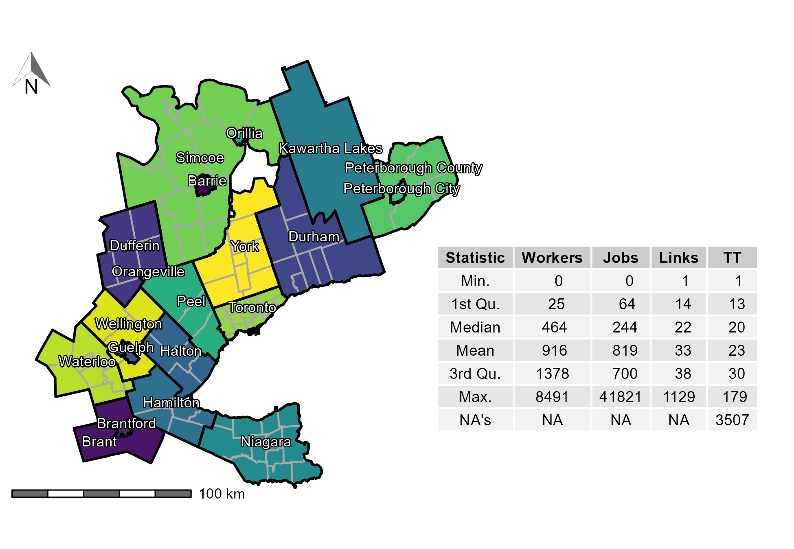
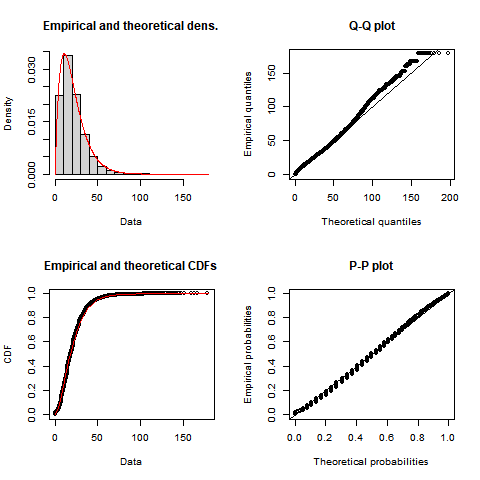

```{r knitr-setup, include=FALSE}
knitr::opts_chunk$set(
  echo = FALSE,
  cache = TRUE,
  warning = FALSE,
  comment = '', 
  out.width = "1\\linewidth")
```

```{r install-data-package, include=FALSE}
if (!require("TTS2016R", character.only = TRUE)) {
      remotes::install_github("soukhova/TTS2016R",
                        build_vignettes = TRUE)
  }
```

```{r load-packages, include=FALSE, cache=FALSE}
library(TTS2016R)
library(dplyr)
library(fitdistrplus)
library(ggplot2)
library(kableExtra)
library(patchwork)
library(sf)
library(scales)
library(stats)
library(ggspatial)
library(shadowtext)
library(tmap)
library(ggpmisc)
# library(ggpmisc)
# library(ggrepel)
# library(cowplot)
# library(spdep)
# library(RColorBrewer)
# library(extrafont)
# font_import()
# loadfonts(device = "win")

options(scipen = 999)
```

# Introduction

This manuscript presents the open data product [{TTS2016R}](https://github.com/soukhova/TTS2016R). Open data products are the result of turning source data (open or otherwise) into accessible information that adds value to the original inputs [see @Arribas2021open]. The product presented in this paper is an `R` data package which currently consists of three objects which are sourced from the 2016 Transportation Tomorrow Survey (TTS) or are curated to facilitate the use and analysis of TTS data. This package includes person-to-jobs origin-destinations, traffic analysis zone (TAZ) boundaries, and planning/municipality boundaries for the Greater Golden Horse area (GGH) located in southern Ontario, Canada [@data_management_group_tts_2018]. In addition, the package includes TAZ centroid-to-centroid travel times by car computed using package {r5r} [@Pereira2021r5r]. The aim of this paper is to walk readers through the empirical home-based work commute data set, illustrate the calculation of an impedance function that can be used to calculate accessibility to employment, and invite its use in other applications.

<!-- Data from the TTS are in principle available to the public but are not fully open, since permission to access the data retrieval system is required. In addition, the raw data can be technically demanding, cumbersome to work with, and requires multiple software to process. By pre-processing the data in a `R` environment, {TTS2016R} offers a slice of the TTS data useful to understand patterns of commuting to work in the region. It also provides open infrastructure for additional TTS or complimentary data sets to be amended by the authors or wider open-source community in the future. -->

# Home-to-work commute data

{TTS2016R} includes counts of fully-employed population by place of residence (origin) and counts of full-time jobs by place of work (destination) aggregated by TAZ (n=`r round(length(TTS2016R::ggh_taz$GTA06), 3) %>% prettyNum(big.mark = ",")` within the survey boundaries). TAZ typically are defined based on land-use and population demographics in order to estimate the number of trips produced and attracted to each zone [@meyer_urban_2001]. As such, each TAZ is uniquely identified using the GTA06 Zoning System which can be used to join to the origin-destination table (i.e., trips taken).

The number of jobs (`r round(sum(TTS2016R::ggh_taz$jobs), 3) %>% prettyNum(big.mark = ",")`) and workers (`r round(sum(TTS2016R::ggh_taz$workers), 3) %>% prettyNum(big.mark = ",")`) in this package are organized in the form of an origin-destination table which is indicative of home-to-work commute patterns (there are `r round(sum(TTS2016R::od_ft_tt$trips), 3) %>% prettyNum(big.mark = ",")` potential interactions). These data were retrieved from the TTS Data Retrieval System on October 28, 2021 and reflect the potential interaction of full-time employed people and jobs within the GGH survey boundaries shown in Figure \ref{fig:TTS-16-survey-area} as defined by the 2016 TTS methodology [@data_management_group_tts_2018].

Also included in {TTS2016R} are travel times and cost of travel from origin to destination by car; travel times are calculated using the `R` package {r5r}. These travel times are useful to estimate the cost of travel and to calculate impedance functions, among other possible applications. For simplicity, all interactions within {TTS2016R} are assumed to be taken by car, and the travel time is calculated from an origin TAZ centroid to a destination TAZ centroid. The centroid is snapped to the nearest street line by `r5r` and the travel time is calculated for all trips assuming a car travel mode. Additionally, only travel times less than or equal to 180 mins (3 hrs) are calculated; this threshold represents 99% of trip's travel times which are summarized in Figure \ref{fig:TTS-16-survey-area}.
```{r, echo=FALSE, message=FALSE, warning=FALSE}
# grouping the planning boundaries/municipalities so they make up the 20 regions in the TTS 2016. Note: st_buffer is used as there are small existing gaps between some boundaries. st_buffer of 10 m is enough to widen all boundaries and complete the st_union without issue.
group_ggh_pd_poly <- TTS2016R::ggh_pd %>% st_buffer(10) %>% group_by(REGION) %>% 
  summarize(REGION_name = first(REGION_name),
            geometry = st_union((geometry)))

# creating an object of centroids for each region - this will be used to label polygons on the map
group_ggh_pd <- sf::st_centroid(group_ggh_pd_poly) 
points <- sf::st_coordinates(group_ggh_pd) %>% data.frame() 
group_ggh_pd <- cbind(group_ggh_pd, points)

## manually readjusting the X and Y coordinate of "County of Peterborough" and "Brant" as they overlap some cities
group_ggh_pd[group_ggh_pd$REGION_name=="Brant", "X"] <- 544000.0
group_ggh_pd[group_ggh_pd$REGION_name=="Brant", "Y"] <- 4767466

group_ggh_pd[group_ggh_pd$REGION_name=="Peterborough County", "Y"] <- 4921000
```
```{r, echo=FALSE, message=FALSE, warning=FALSE, include = FALSE}
#plot 
TTS_area_plot <- ggplot() +
  geom_sf(data = TTS2016R::ggh_pd, color = "darkgray",
          aes(fill = REGION_name)) +
  scale_fill_manual(values = viridis::viridis(20)) +
  geom_sf(data = group_ggh_pd_poly, 
          color = "black", fill = NA, size = 0.7) +
  annotation_north_arrow(location = "tl", # north arrow for both the main plot
                         height = unit(0.8, "cm"), 
                         width = unit(0.8, "cm"),
                         style = north_arrow_orienteering(line_width = 0.25,
                                                          line_col = "dimgrey", 
                                                          fill = c("white","dimgrey"))) +
  annotation_scale(bar_cols = c("dimgrey", "white"), # scale bar for both the main plot
                   height = unit(0.15, "cm")) + 
  geom_shadowtext(data = group_ggh_pd,
                  aes(x = X, y = Y, label = REGION_name),
                  size = 3,
                  nudge_y = 3000,
                  nudge_x = 2000) +
  theme_void() +
  theme(legend.position = "none",
        axis.title = element_blank()) 

# ggsave("images/TTS16-survey-area.png")
```
```{r creating-desc-stats-table}
#forming a complete descriptive statistic table

Statistics <- data.frame("Statistic" = c("Min.", "1st Qu.", "Median", "Mean", "3rd Qu.", "Max.", "NA's"))

Trips <- data.frame("Trips" = c(summary(od_ft_tt$trips)[[1]] %>% round(), 
                                   summary(od_ft_tt$trips)[[2]] %>% round(),  
                                   summary(od_ft_tt$trips)[[3]] %>% round(), 
                                   summary(od_ft_tt$trips)[[4]] %>% round(), 
                                   summary(od_ft_tt$trips)[[5]] %>% round(),
                                   summary(od_ft_tt$trips)[[6]]%>% round(),
                                   NA))

Travel_time <- data.frame("TT" = c(summary(od_ft_tt$travel_time)[[1]] %>% round(), 
                                               summary(od_ft_tt$travel_time)[[2]] %>% round(),  
                                               summary(od_ft_tt$travel_time)[[3]] %>% round(), 
                                               summary(od_ft_tt$travel_time)[[4]] %>% round(), 
                                               summary(od_ft_tt$travel_time)[[5]] %>% round(), 
                                               summary(od_ft_tt$travel_time)[[6]] %>% round(),  
                                               3507)) 

# TAZ_Area <- data.frame("TAZ_Area" = c(summary(ggh_taz$AREA)[[1]] %>% round(1), 
#                                       summary(ggh_taz$AREA)[[2]] %>% round(1), 
#                                       summary(ggh_taz$AREA)[[3]] %>% round(1), 
#                                       summary(ggh_taz$AREA)[[4]] %>% round(1), 
#                                       summary(ggh_taz$AREA)[[5]] %>% round(1), 
#                                       summary(ggh_taz$AREA)[[6]] %>% round(1), 
#                                       NA))

Workers <- data.frame("Workers" = c(summary(ggh_taz$workers)[[1]] %>% round(), 
                                    summary(ggh_taz$workers)[[2]] %>% round(), 
                                    summary(ggh_taz$workers)[[3]] %>% round(), 
                                    summary(ggh_taz$workers)[[4]] %>% round(), 
                                    summary(ggh_taz$workers)[[5]] %>% round(), 
                                    summary(ggh_taz$workers)[[6]] %>% round(), 
                                    NA))

Jobs <- data.frame("Jobs" = c(summary(ggh_taz$jobs)[[1]] %>% round(), 
                              summary(ggh_taz$jobs)[[2]] %>% round(), 
                              summary(ggh_taz$jobs)[[3]] %>% round(), 
                              summary(ggh_taz$jobs)[[4]] %>% round(), 
                              summary(ggh_taz$jobs)[[5]] %>% round(), 
                              summary(ggh_taz$jobs)[[6]] %>% round(), 
                              NA)) 

desc_stats <- cbind(Statistics, Trips, Travel_time, Workers, Jobs)

# #kable tabling 
# desc_stats %>%
#   kable(format = "latex",
#         align="lrrrrrr",
#         booktabs = T,
#         col.names = c(" ", "(#)", "(min)", "(km^2)", "(#)", "(#)"),
#         caption = "\\label{tab:TTS-16-desc-stats}Descriptive statistics of the trips, calculated origin-destination car travel time, TAZ area, workers per TAZ, and jobs per TAZ.") %>%
#   add_header_above(c(" ", "Trips", "Travel Time", "Area", "Workers", "Jobs"), align = "r")%>%
#   kable_styling(full_width = "T", 
#                 latex_options = c("scale_down"),
#                 position = "center")
```
```{r, TTS-16-survey-area, echo=FALSE, fig.cap="\\label{fig:TTS-16-survey-area}TTS 2016 study area within the GGH in Ontario, Canada along with the descriptive statistics of the trips, calculated origin-destination car travel time (TT), workers per TAZ, and jobs per TAZ. Contains 20 regions (black boundaries) and sub-regions (dark gray boundaries).", out.width="100%", fig.align='center'}
# 

TTS_area_plot + annotate(geom = "table",
            x = 915000, y = 4880000, 
           label = list(desc_stats))
```
## Employed individuals and jobs

The origin-destination table (i.e., trips) consists of a cross-tabulation of people who are employed full-time by place of GGH residence (origin) and places of GGH employment (destination) using the GTA06 TAZ zoning system. It is important to note that the total number of workers and jobs is the TTS 2016 region are not equal but the number of trips taken are equal to the number of workers. Since the outer boundaries of the TTS are permeable, workers who reside within the boundaries but travel outside of the boundaries are counted as workers within an origin TAZ, while jobs in TAZ that are filled by workers who reside outside the GGH boundaries are _unknown_ since they were not surveyed. This mismatch results in the total number of workers being `r round(sum(ggh_taz$workers)/sum(ggh_taz$jobs),2)` times larger than the number of jobs (i.e., `r sum(ggh_taz$workers)%>% prettyNum(big.mark = ",")` workers to `r sum(ggh_taz$jobs)%>% prettyNum(big.mark = ",")` jobs). As such, the origin-destination table contained in {TTS2016R} offers a perspective on all workers in the GGH and their home-based trips to places of GGH employment.

```{r tts-workers-jobs-plot, fig.cap="\\label{fig:tts-workers-jobs-plot}Number of workers (left) and jobs (right) in each TAZ in the 2016 TTS.", fig.width=8, fig.height=5}

tts_workers <- tm_shape(ggh_taz) +
  tm_fill(col = "workers", title = "Full-time \nemployed people", palette = "-Spectral", style = "jenks") +
  tm_compass(type = "arrow", position = c("left", "top"), size = 2) +
  tm_scale_bar(breaks = c(0, 30, 60), text.size = 0.5, position = c("left", "bottom")) +
  tm_layout(legend.position = c("right", "bottom"))

tts_jobs <- tm_shape(ggh_taz) +
  tm_fill(col = "jobs", title = "Full-time \njobs", palette = "-Spectral", style = "jenks") +
  tm_compass(type = "arrow", position = c("left", "top"), size = 2) +
  tm_scale_bar(breaks = c(0, 30, 60), text.size = 0.5, position = c("left", "bottom")) +
  tm_layout(legend.position = c("right", "bottom"))

tmap_arrange(tts_workers, tts_jobs)

```

<!--
```{r ECD-plot, fig.cap="\\label{fig:ECD-plot}The cumulative distribution of the number of jobs and workers per TAZ from the 2016 TTS data set. Light blue shaded ranges correspond to all cumulative proabilities where the number of workers per TAZ are larger than jobs per TAZ.", fig.width=8, fig.height=4}

Number <- rbind(ggh_taz$jobs %>% data.frame(),
                 ggh_taz$workers %>% data.frame())
Group <- rbind(rep("Jobs", each=length(ggh_taz$jobs)) %>% data.frame(),
                rep("Workers", each=length(ggh_taz$workers))%>% data.frame())

ecdf_data <- cbind(Number, Group)
colnames(ecdf_data) <- c("Number", "Group")

rect1 <- data.frame(xmin=115, xmax=3055, ymin=-Inf, ymax=Inf)
  
ggplot(ecdf_data , aes(x=Number, col=Group)) + 
  # geom_segment(aes(x = 115, y = 0, xend = 115, yend = 0.34), col = "blue", linetype=2) +
  # geom_segment(aes(x = 3055, y = 0, xend = 3055, yend = 0.94), col = "blue", linetype=2) +
  geom_rect(data = rect1, aes(xmin=xmin, xmax=xmax, ymin=ymin, ymax=ymax), fill="lightblue", alpha=0.2, inherit.aes = FALSE) +
  stat_ecdf() + 
  scale_x_continuous(trans='sqrt', breaks=c(115, 3055, 10000, 20000, 30000, 40000)) + 
  scale_y_continuous(breaks=c(0, 0.25,0.34, .50, .75,0.94, 1.00)) +
  labs(x = "Opportunities per TAZ",
       y = "Cumulative probability") + 
      scale_color_manual("Opportunities", 
                         values = c("Jobs" = "Black",
                                    "Workers" = "Red"))+
  scale_linetype_manual("Opportunities",values=c(0,1)) +
  geom_point(aes(x = 115, y = 0.34), col = "blue")+
  geom_point(aes(x=3055, y=0.94), col = "blue") +
  theme_minimal() +
  theme(plot.title = element_text(hjust=0.5),
        legend.position = c(0.90,0.75),
        axis.line = element_line(colour = "black"),
        panel.border = element_blank()) 
```
-->
Figure \ref{fig:tts-workers-jobs-plot} presents the number of workers and jobs per TAZ. It can be observed that the spatial distribution of jobs and workers is unequal, which is indicative of a jobs-housing imbalance that can impact accessibility in a region [@Levine1998rethinking]. It can also be seen that there is a higher number of TAZ with no workers than zones with no jobs (i.e., `r ggh_taz %>% st_drop_geometry() %>% count(workers) %>% filter(workers == 0) %>% pull('n')` TAZ with no workers : `r ggh_taz %>% st_drop_geometry() %>% count(jobs) %>% filter(jobs == 0) %>% pull('n')` TAZ with no jobs) and the mean of workers per TAZ is higher than the mean of jobs (i.e., `r round(mean(ggh_taz$workers, na.rm=T),0)` workers : `r round(mean(ggh_taz$jobs, na.rm=T),0)` jobs) the number TAZ with an extreme number of jobs at the highest and lowest percentiles is significantly higher than the number of workers. <!-- see the following cumulative probability distribution in Figure \ref{fig:ECD-plot}. -->

<!-- Workers are concentrated in TAZ within the center of the GGH and along the south-east and northern boarder of the GGH. The center of the GGH corresponds to the Greater Toronto Area (GTA) which is the most densely populated area in southern Ontario [@statistics_canada_daily_2022]. The south east border of the GGH neighbours Lake Ontario and is delineated by the urban built boundary of the Ontario Growth Plan being home to the highest density of working population in the GGH [@ontario_built_2019;@auditor_general_of_ontario_value_2021]. The northern GGH border corresponds to the Simcoe, Dufferin, Kawartha Lake, and Peterborough regions which are home to lower density of worker population density population [@auditor_general_of_ontario_value_2021]. Conversely, the spread of jobs in the GGH is lower than the number of workers indicating population is more spatially dispersed than jobs. -->

<!--- in which the 94th to 100th percentile and the 0th to 34th percentile of jobs in TAZ is higher than the number of workers in TAZ. This means that between these ranges, TAZ have a higher number of workers than they do jobs, echoing the more even spatial distribution of workers observed in Figure \ref{fig:tts-workers-jobs-plot}. -->

## Calculated travel time

As mentioned, {TTS2016R} also includes travel time data for each home-to-work trip as displayed in Figure \ref{fig:plot-tt-ttpertrip}. This travel time corresponds to a car commute calculated using the R package {r5r} (see descriptive statistics in Table \ref{tab:TTS-16-desc-stats}). It is important to note that travel times within this data set are calculated assuming only car travel and one departure time for all origins. These assumptions are not completely realistic since we know a small proportion of trips are taken by non-car modes and travel time departures varies. However, it is not possible from the data retrieval system to obtain higher order tabulations so <!--  we do not know which trips are made with non-car modes nor exact departure times in these tables. Though modal split and travel times can be estimated through other methods [e.g., @allen_suburbanization_2021; @higgins2021changes], for simplicity,-->  we carry on with the assume that all trips are taken by one-time departure car trip. 

```{r data-for-impedance}
# remove all NA trips from dataset and set all 0min travel times to 0.1 min
od_ft_tt  <- TTS2016R::od_ft_tt %>% 
  filter( !is.na(travel_time)) %>% 
  mutate(travel_time = ifelse(travel_time == 0, 0.1, travel_time))

all_tt <- od_ft_tt  %>% 
  dplyr::select(trips, travel_time)

all_tt <- all_tt[rep(seq_len(dim(all_tt)[1]), all_tt$trips), 2]
```

```{r fitting-impedance}
#fitting impedance function
gamma_ <- fitdistrplus::fitdist(data=all_tt, "gamma", method="mle", optim.method="Nelder-Mead") 
```

```{r calc-for-accessibility-GGH}
# transfer calibrated impedance function values to OD matrix
od_ft_tt <- od_ft_tt %>%
  mutate(f = dgamma(travel_time, gamma_$estimate["shape"], gamma_$estimate["rate"]))

#add the number of jobs and workers to the od_ft_tt matrix
od_ft <- od_ft_tt %>% merge(ggh_taz %>% dplyr::select(GTA06, workers) %>% st_drop_geometry(),
                   by.x = "Origin", by.y="GTA06", all.x = TRUE)

od_ft <- od_ft %>% merge(ggh_taz %>% dplyr::select(GTA06, jobs) %>% st_drop_geometry(),
                   by.x = "Destination", by.y="GTA06", all.x = TRUE)


#calculate accessibility for workers from any origin to jobs in Toronto 
GGH_c_accessibility <- od_ft %>% 
  mutate(GGH_A_ij = f * jobs) %>%
  group_by(Origin) %>%
  summarise(GGH_A_i = sum(GGH_A_ij, na.rm = T),
            GGH_sum_tt_i = sum(travel_time),
            GGH_tt_trips_i = mean(travel_time),
            GGH_sum_f_i = sum(f),
            GGH_f_trips_i = mean(f))

#Merge TO accessibly calculation to the ggh_taz:
GGH_taz_acc <- ggh_taz %>% merge(GGH_c_accessibility, by.x=c("GTA06"), by.y=c("Origin"), all.x=T) 
```

```{r plot-tt-ttpertrip, fig.cap="\\label{fig:plot-tt-ttpertrip}Calculated total worker travel time (left) and average worker travel time (right) for each TAZ in the 2016 TTS.", fig.width=8, fig.height=5, message=FALSE}

tts_total_tt <- tm_shape(GGH_taz_acc) +
  tm_fill(col = "GGH_sum_tt_i", title = "Total travel time\n per TAZ (min)", palette = "-Spectral", style = "jenks") +
  tm_compass(type = "arrow", position = c("left", "top"), size = 2) +
  tm_scale_bar(breaks = c(0, 30, 60), text.size = 0.5, position = c("left", "bottom")) +
  tm_layout(legend.position = c("right", "bottom"))

tts_tt_per_trip <- tm_shape(GGH_taz_acc) +
  tm_fill(col = "GGH_tt_trips_i", title = "Avg. travel time\n per TAZ (min)", palette = "-Spectral", style = "jenks") +
  tm_compass(type = "arrow", position = c("left", "top"), size = 2) +
  tm_scale_bar(breaks = c(0, 30, 60), text.size = 0.5, position = c("left", "bottom")) +
  tm_layout(legend.position = c("right", "bottom"))

tmap_arrange(tts_total_tt, tts_tt_per_trip)
```

\newpage

As can be observed in Figure \ref{fig:plot-tt-ttpertrip}, the total travel time resembles the spatial trend distribution in the number of employed people in the previous plot (Figure \ref{fig:tts-workers-jobs-plot}) and the spatial distribution of the average travel time is distinct from other plots presented so far. We can see that in areas around the south-eastern border that make up the Greater Toronto and Hamilton Area (GTHA)<!-- (e.g., Hamilton, Halton, Peel, Toronto, York, Durham) -->, Niagara and Waterloo, the average travel times are moderately low. Further from these areas, travel times are higher. Interestingly, even in eastern areas (e.g., Peterborough) with high employment and high job concentration, average travel time is higher than within the GTHA.

## Calibrating an impedance function

Impedance functions are useful to understand mobility behaviour and are used to estimate gravity models of spatial interaction [@wilson1971; @haynes_gravity_1985] and applied in accessibility analysis [@hansen_how_1959;@talen_assessing_1998;@paez_jobs_2013;@barboza_balancing_2021]. An impedance function $f(\cdot)$ depends on the cost of travel $c_{ij}$ between locations $i$ and $j$ (all which is supplied in the travel time and origin-destination table within {TTS2016R}). <!-- The impedance function is usually a monotonically decreasing function since the separation of land uses means that very short commuting trips are relatively rare. However, sometimes the function can increase to reflect patterns of separation between activities. This could be needed to reflect fluctuations in travel cost due to hierarchical patterns, where travelers bypass opportunities in favor of more distant destinations that offer economies of agglomeration. -->

A useful technique to calibrate an impedance function is to use the trip length distribution (TLD) as measured from origin-destination data [@horbachov_theoretical_2018; @batista_estimation_2019]. The TLD is the representation of the likelihood that a proportion of trips are taken at a specific travel cost. In our data set, where we assume cost is travel time, the impedance function maps low travel times to higher proportions of trips, and high travel times are mapped to low proportion of trips.

Using the data contained in {TTS2016R}, we fit the empirical TLD to a density distribution using maximum likelihood techniques and the Nelder-Mead method for direct optimization available within the `R` package {fitdistrplus} [@fitdistrplus_2015]. Based on goodness-of-fit criteria and diagnostics seen in Figure \ref{fig:TLD-Gamma-plot}, the gamma distribution is selected. The 'shape' parameter is $\alpha$ = `r round(gamma_$estimate[1], 3)`, the estimated 'rate' is $\beta$ = `r round(gamma_$estimate[2], 3)` , and $\Gamma(\alpha)$ is defined in Equation (\ref{gamma-dist}).

```{r save-impedance-plot, include=FALSE}
# For some reason plot(gamma_) does not play well with knitr, so instead we save the figure and then include it as a graphic in the following chunk
png("images/impedance_function.png")
plot(gamma_)
dev.off()
```

```{r TLD-Gamma-plot, fig.cap="\\label{fig:TLD-Gamma-plot}Empirical TTS 2016 home-based car TLD (black) and calibrated gamma distribution impedance function (red) with associated Q-Q and P-P plots", out.width="75%", fig.align='center'}

```

\begin{equation}
\label{gamma-dist}
\begin{array}{l}\ 
f(x, \alpha, \beta) = \frac {x^{\alpha-1}e^{-\frac{x}{\beta}}}{ \beta^{\alpha}\Gamma(\alpha)} \quad \text{for }	0 \leq x \leq \infty\\
\Gamma(\alpha) =  \int_{0}^{\infty} x^{\alpha-1}e^{-x} \,dx\\
\end{array}
\end{equation}

```{r create-cullen-frey-data}
# remove all NA trips from dataset and set all 0min travel times to 0.1min
od_ft_tt  <- od_ft_tt %>% filter( !is.na(travel_time)) %>% mutate(travel_time = ifelse(travel_time == 0, 0.1, travel_time))
all_tt <- od_ft_tt  %>% dplyr::select(trips, travel_time)
all_tt <- all_tt[rep(seq_len(dim(all_tt)[1]), all_tt$trips), 2]
```

<!-- # ```{r plot-cullen-frey, message = FALSE, fig.height=6, fig.cap="\\label{fig:plot-cullen-frey}Cullen and frey graphy for the 2016 TTS calculated travel times."} -->
<!-- # fitdistrplus::descdist(data=all_tt)  -->
<!-- # ``` -->

\newpage

# Concluding remarks

The open data product introduced in this paper shares tables for home-to-work related data from the 2016 TTS. In addition, inter-centroid travel time tables are calculated, and the planning/municipality boundaries are included as a compliment. This open data product, {TTS2016R}, is freely available to explore in an `R` environment. One possible use of this data, as showcased in this paper, is the calibration of impedance functions which in turn can be used for accessibility analysis.

<!-- New digital formats are increasingly complex and the explanation of the methods often do not concisely and intelligibly fit within the confines of a traditional article. With this motivation, we invite all who are interested to use {TTS2016R} to explore the worker-employment patterns contained in the {TTS2016R} package. --> In the spirit of novel and original research, we hope readers value the efforts made to detail the data in order to improve transparency in our work and encourage others to replicate and, hopefully, inspire research of their own. We see this product as providing open infrastructure for additional TTS or complimentary data sets to be amended by the authors or wider open-source community in the future. 


# References {#references .unnumbered}
