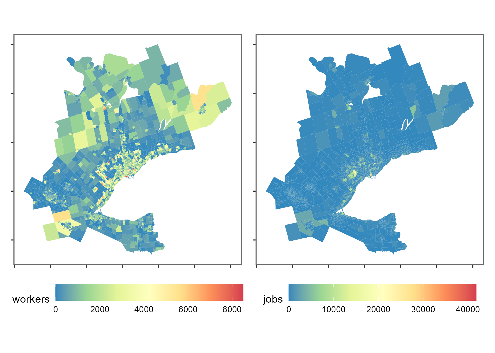

<!-- README.md is generated from README.Rmd. Please edit that file -->

```{r, include = FALSE}
knitr::opts_chunk$set(
  collapse = TRUE,
  comment = "#>",
  fig.path = "man/figures/README-",
  out.width = "100%"
)
```

# TTS2016R

## 2016 Transportation Tomorrow Survey (TTS) data package: trips and estimated travel time to work in the Greater Golden Horsehoe area, Canada

[](https://zenodo.org/badge/latestdoi/465815515)

This package contains objects which are sourced from the 2016
Transportation Tomorrow Survey
[(TTS)](http://dmg.utoronto.ca/drs) or are curated to
facilitate the use and analysis of TTS data. TTS 2016 is one of the
largest travel surveys in southern Ontario, Canada, and a slice of this
survey has been cleaned, packaged, and augmented for easy use in an `R`
environment.

<!-- badges: start -->
<!-- badges: end -->

## Setup

Installation:

``` r
if (!require("remotes", character.only = TRUE)) {
      install.packages("remotes")
  }
remotes::install_github("soukhova/TTS2016R",
                        build_vignettes = TRUE)
```

## TTS 2016 Data Overview

The 2016 Transportation Tomorrow Survey (TTS) data for the the Greater Golden Horseshoe (GGH) area in the province of Ontario, Canada (43.6°N 79.73°W) is included; specifically the location of origins and destinations defined by Traffic Analysis Zones (TAZ), the associated municipality boundaries, the number of jobs and workers at each origin and destination, and the trips (by primary mode) from origin to destination for the morning home-to-work commute. Also included are calculated travel times by car (calculated via [`r5r`](https://github.com/ipeaGIT/r5r)) and a derived impedance function values corresponding to the cost of travel based on the trip length distribution.


See the plot below for a spatial visualization of the number of workers
and jobs within each TAZ:



Let's take a look at the TTS 2016 OD data. The following table shows some origin-destination pairs which ave 2 workers at the origin and their associated estimated car travel time (minutes):
<table>
<thead>
<tr>
<th style="text-align:left;">
Origin
</th>
<th style="text-align:left;">
Destination
</th>
<th style="text-align:right;">
Workers
</th>
<th style="text-align:right;">
Travel Time (min)
</th>
</tr>
</thead>
<tbody>
<tr>
<td style="text-align:left;">
3640
</td>
<td style="text-align:left;">
3718
</td>
<td style="text-align:right;">
2
</td>
<td style="text-align:right;">
24
</td>
</tr>
<tr>
<td style="text-align:left;">
3640
</td>
<td style="text-align:left;">
3849
</td>
<td style="text-align:right;">
2
</td>
<td style="text-align:right;">
20
</td>
</tr>
<tr>
<td style="text-align:left;">
3640
</td>
<td style="text-align:left;">
3866
</td>
<td style="text-align:right;">
2
</td>
<td style="text-align:right;">
20
</td>
</tr>
<tr>
<td style="text-align:left;">
3879
</td>
<td style="text-align:left;">
3877
</td>
<td style="text-align:right;">
2
</td>
<td style="text-align:right;">
8
</td>
</tr>
<tr>
<td style="text-align:left;">
3879
</td>
<td style="text-align:left;">
4003
</td>
<td style="text-align:right;">
2
</td>
<td style="text-align:right;">
17
</td>
</tr>
<tr>
<td style="text-align:left;">
3879
</td>
<td style="text-align:left;">
4007
</td>
<td style="text-align:right;">
2
</td>
<td style="text-align:right;">
18
</td>
</tr>
<tr>
<td style="text-align:left;">
3879
</td>
<td style="text-align:left;">
63
</td>
<td style="text-align:right;">
2
</td>
<td style="text-align:right;">
24
</td>
</tr>
<tr>
<td style="text-align:left;">
8417
</td>
<td style="text-align:left;">
3152
</td>
<td style="text-align:right;">
2
</td>
<td style="text-align:right;">
43
</td>
</tr>
<tr>
<td style="text-align:left;">
8417
</td>
<td style="text-align:left;">
3707
</td>
<td style="text-align:right;">
2
</td>
<td style="text-align:right;">
62
</td>
</tr>
<tr>
<td style="text-align:left;">
8417
</td>
<td style="text-align:left;">
3816
</td>
<td style="text-align:right;">
2
</td>
<td style="text-align:right;">
65
</td>
</tr>
<tr>
<td style="text-align:left;">
8417
</td>
<td style="text-align:left;">
55
</td>
<td style="text-align:right;">
2
</td>
<td style="text-align:right;">
82
</td>
</tr>
<tr>
<td style="text-align:left;">
8417
</td>
<td style="text-align:left;">
8415
</td>
<td style="text-align:right;">
2
</td>
<td style="text-align:right;">
43
</td>
</tr>
</tbody>
</table>

See .Rmd files in the
[`\data-raw folder`](https://github.com/soukhova/TTS2016R/tree/master/data-raw)
for additional details on how the included data sets were compiled. See the
[vignettes](https://soukhova.github.io/TTS2016R/index.html) for detailed
examples using the data sets and comparing comparison of different
accessibility measures.

## Contributing to this data package

The purpose of this data package is to make the data of the TTS 2016 easily and freely available for analysis in an R environment. Currently, the data package provides a few slices of the TTS 2016, but we invite others from the community to request additional data, report issues, and even contribute to the data package. 

If interested in contributing, please try to adhere to the following steps:

1. If you notice spelling errors or other hick-ups, please submit an issue. 
2. If you use the data package and would like to share an interesting use case or analysis, please fork the repository, save the analysis file in [vignettes](https://github.com/soukhova/TTS2016R/tree/master/vignettes/articles) and submit a pull request. Analysis files will be reviewed and added added as articles (with full credit).
