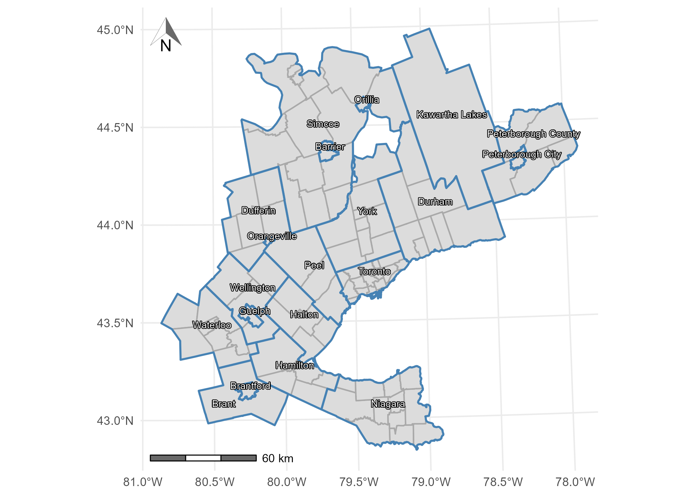

<!-- README.md is generated from README.Rmd. Please edit that file -->

```{r, include = FALSE}
knitr::opts_chunk$set(
  collapse = TRUE,
  comment = "#>",
  fig.path = "man/figures/README-",
  out.width = "100%"
)
```

# 2016 Transportation Tomorrow Survey (TTS) data package: trips and estimated travel time to work in the Greater Golden Horsehoe area, Canada

[](https://zenodo.org/badge/latestdoi/465815515)

This package contains objects which are sourced from the 2016
Transportation Tomorrow Survey
[(TTS)](http://dmg.utoronto.ca/survey-boundary-files) or are curated to
facilitate the use and analysis of TTS data. TTS 2016 is one of the
largest travel surveys in southern Ontario, Canada, and a slice of this
survey has been cleaned, packaged, and augmented for easy use in an `R`
environment.

<!-- badges: start -->
<!-- badges: end -->

## Setup

Installation:

``` r
if (!require("remotes", character.only = TRUE)) {
      install.packages("remotes")
  }
remotes::install_github("soukhova/TTS2016R",
                        build_vignettes = TRUE)
```

Libraries:

``` r
library(TTS2016R)
library(tidyverse)
library(ggplot2)
library(kableExtra)
library(patchwork)
library(ggspatial)
library(shadowtext)
library(sf)
```

## TTS 2016 Data Overview

The 2016 Transportation Tomorrow Survey (TTS) data for the the Greater
Golden Horseshoe (GGH) area in the province of Ontario, Canada (43.6°N
79.73°W) is included; specifically the location of origins and
destinations defined by Traffic Analysis Zones (TAZ), the associated
municipality boundaries, the number of jobs and workers at each origin
and destination, and the trips from origin to destination for the
morning home-to-work commute. Also included are calculated travel times
by car (calculated via [`r5r`](https://github.com/ipeaGIT/r5r)) and a
derived impedance function values corresponding to the cost of travel
based on the trip length distribution.



See the plot below for a spatial visualization of the number of workers
and jobs within each TAZ:


Sample of TTS 2016 OD data (OD pairs with 2 trips):
<table>
<thead>
<tr>
<th style="text-align:left;">
Origin
</th>
<th style="text-align:left;">
Destination
</th>
<th style="text-align:right;">
trips
</th>
<th style="text-align:right;">
travel_time
</th>
</tr>
</thead>
<tbody>
<tr>
<td style="text-align:left;">
3640
</td>
<td style="text-align:left;">
3718
</td>
<td style="text-align:right;">
2
</td>
<td style="text-align:right;">
24
</td>
</tr>
<tr>
<td style="text-align:left;">
3640
</td>
<td style="text-align:left;">
3849
</td>
<td style="text-align:right;">
2
</td>
<td style="text-align:right;">
20
</td>
</tr>
<tr>
<td style="text-align:left;">
3640
</td>
<td style="text-align:left;">
3866
</td>
<td style="text-align:right;">
2
</td>
<td style="text-align:right;">
20
</td>
</tr>
<tr>
<td style="text-align:left;">
3879
</td>
<td style="text-align:left;">
3877
</td>
<td style="text-align:right;">
2
</td>
<td style="text-align:right;">
8
</td>
</tr>
<tr>
<td style="text-align:left;">
3879
</td>
<td style="text-align:left;">
4003
</td>
<td style="text-align:right;">
2
</td>
<td style="text-align:right;">
17
</td>
</tr>
<tr>
<td style="text-align:left;">
3879
</td>
<td style="text-align:left;">
4007
</td>
<td style="text-align:right;">
2
</td>
<td style="text-align:right;">
18
</td>
</tr>
<tr>
<td style="text-align:left;">
3879
</td>
<td style="text-align:left;">
63
</td>
<td style="text-align:right;">
2
</td>
<td style="text-align:right;">
24
</td>
</tr>
<tr>
<td style="text-align:left;">
8417
</td>
<td style="text-align:left;">
3152
</td>
<td style="text-align:right;">
2
</td>
<td style="text-align:right;">
43
</td>
</tr>
<tr>
<td style="text-align:left;">
8417
</td>
<td style="text-align:left;">
3707
</td>
<td style="text-align:right;">
2
</td>
<td style="text-align:right;">
62
</td>
</tr>
<tr>
<td style="text-align:left;">
8417
</td>
<td style="text-align:left;">
3816
</td>
<td style="text-align:right;">
2
</td>
<td style="text-align:right;">
65
</td>
</tr>
<tr>
<td style="text-align:left;">
8417
</td>
<td style="text-align:left;">
55
</td>
<td style="text-align:right;">
2
</td>
<td style="text-align:right;">
82
</td>
</tr>
<tr>
<td style="text-align:left;">
8417
</td>
<td style="text-align:left;">
8415
</td>
<td style="text-align:right;">
2
</td>
<td style="text-align:right;">
43
</td>
</tr>
</tbody>
</table>
Summary statistics of TTS 2016 OD data, where `trips` are the number of
journeys from origin to destination, calculated `travel_time` by car,
and `f` is the impedance value:
<table>
<thead>
<tr>
<th style="text-align:left;">
</th>
<th style="text-align:left;">
Origin
</th>
<th style="text-align:left;">
Destination
</th>
<th style="text-align:left;">
trips
</th>
<th style="text-align:left;">
travel_time
</th>
</tr>
</thead>
<tbody>
<tr>
<td style="text-align:left;">
</td>
<td style="text-align:left;">
Length:103076
</td>
<td style="text-align:left;">
Length:103076
</td>
<td style="text-align:left;">
Min. : 1
</td>
<td style="text-align:left;">
Min. : 0
</td>
</tr>
<tr>
<td style="text-align:left;">
</td>
<td style="text-align:left;">
Class :character
</td>
<td style="text-align:left;">
Class :character
</td>
<td style="text-align:left;">
1st Qu.: 14
</td>
<td style="text-align:left;">
1st Qu.: 13
</td>
</tr>
<tr>
<td style="text-align:left;">
</td>
<td style="text-align:left;">
Mode :character
</td>
<td style="text-align:left;">
Mode :character
</td>
<td style="text-align:left;">
Median : 22
</td>
<td style="text-align:left;">
Median : 20
</td>
</tr>
<tr>
<td style="text-align:left;">
</td>
<td style="text-align:left;">
NA
</td>
<td style="text-align:left;">
NA
</td>
<td style="text-align:left;">
Mean : 33
</td>
<td style="text-align:left;">
Mean : 23
</td>
</tr>
<tr>
<td style="text-align:left;">
</td>
<td style="text-align:left;">
NA
</td>
<td style="text-align:left;">
NA
</td>
<td style="text-align:left;">
3rd Qu.: 38
</td>
<td style="text-align:left;">
3rd Qu.: 30
</td>
</tr>
<tr>
<td style="text-align:left;">
</td>
<td style="text-align:left;">
NA
</td>
<td style="text-align:left;">
NA
</td>
<td style="text-align:left;">
Max. :1129
</td>
<td style="text-align:left;">
Max. :179
</td>
</tr>
<tr>
<td style="text-align:left;">
</td>
<td style="text-align:left;">
NA
</td>
<td style="text-align:left;">
NA
</td>
<td style="text-align:left;">
NA
</td>
<td style="text-align:left;">
NA’s :3507
</td>
</tr>
</tbody>
</table>

See .Rmd in the
[`\data-raw folder`](https://github.com/soukhova/TTS2016R/tree/master/data-raw)
for additional details on how the datasets were compiled. See the
[vignettes](https://soukhova.github.io/TTS2016R/index.html) for detailed
examples using the datasets and comparing comparison of the conventional
accessibility and **spatial availability** measures.

## Toy Data Overview

This data is synthetic and can be used if a smaller test set is
preferred. It is used to introduce a new competitive accessibility
measure, **spatial availability**, in the first vignette. See the
location and number of opportunities of employment centers and
population centers in the plot below:


Below is a sample of the OD table (Employment Center 1) for the
theoretical toy data:
<table>
<thead>
<tr>
<th style="text-align:left;">
Origin
</th>
<th style="text-align:left;">
Destination
</th>
<th style="text-align:right;">
Population
</th>
<th style="text-align:right;">
Jobs
</th>
<th style="text-align:right;">
distance
</th>
<th style="text-align:right;">
catchments
</th>
<th style="text-align:right;">
trips
</th>
</tr>
</thead>
<tbody>
<tr>
<td style="text-align:left;">
Population 1
</td>
<td style="text-align:left;">
Employment Center 1
</td>
<td style="text-align:right;">
260
</td>
<td style="text-align:right;">
750
</td>
<td style="text-align:right;">
2548
</td>
<td style="text-align:right;">
1
</td>
<td style="text-align:right;">
88
</td>
</tr>
<tr>
<td style="text-align:left;">
Population 2
</td>
<td style="text-align:left;">
Employment Center 1
</td>
<td style="text-align:right;">
255
</td>
<td style="text-align:right;">
750
</td>
<td style="text-align:right;">
1314
</td>
<td style="text-align:right;">
1
</td>
<td style="text-align:right;">
591
</td>
</tr>
<tr>
<td style="text-align:left;">
Population 3
</td>
<td style="text-align:left;">
Employment Center 1
</td>
<td style="text-align:right;">
510
</td>
<td style="text-align:right;">
750
</td>
<td style="text-align:right;">
3375
</td>
<td style="text-align:right;">
0
</td>
<td style="text-align:right;">
24
</td>
</tr>
<tr>
<td style="text-align:left;">
Population 4
</td>
<td style="text-align:left;">
Employment Center 1
</td>
<td style="text-align:right;">
495
</td>
<td style="text-align:right;">
750
</td>
<td style="text-align:right;">
2170
</td>
<td style="text-align:right;">
0
</td>
<td style="text-align:right;">
157
</td>
</tr>
<tr>
<td style="text-align:left;">
Population 5
</td>
<td style="text-align:left;">
Employment Center 1
</td>
<td style="text-align:right;">
1020
</td>
<td style="text-align:right;">
750
</td>
<td style="text-align:right;">
5112
</td>
<td style="text-align:right;">
0
</td>
<td style="text-align:right;">
2
</td>
</tr>
<tr>
<td style="text-align:left;">
Population 6
</td>
<td style="text-align:left;">
Employment Center 1
</td>
<td style="text-align:right;">
490
</td>
<td style="text-align:right;">
750
</td>
<td style="text-align:right;">
6881
</td>
<td style="text-align:right;">
0
</td>
<td style="text-align:right;">
1
</td>
</tr>
<tr>
<td style="text-align:left;">
Population 7
</td>
<td style="text-align:left;">
Employment Center 1
</td>
<td style="text-align:right;">
980
</td>
<td style="text-align:right;">
750
</td>
<td style="text-align:right;">
4847
</td>
<td style="text-align:right;">
0
</td>
<td style="text-align:right;">
3
</td>
</tr>
<tr>
<td style="text-align:left;">
Population 8
</td>
<td style="text-align:left;">
Employment Center 1
</td>
<td style="text-align:right;">
260
</td>
<td style="text-align:right;">
750
</td>
<td style="text-align:right;">
5303
</td>
<td style="text-align:right;">
0
</td>
<td style="text-align:right;">
1
</td>
</tr>
<tr>
<td style="text-align:left;">
Population 9
</td>
<td style="text-align:left;">
Employment Center 1
</td>
<td style="text-align:right;">
255
</td>
<td style="text-align:right;">
750
</td>
<td style="text-align:right;">
7771
</td>
<td style="text-align:right;">
0
</td>
<td style="text-align:right;">
0
</td>
</tr>
</tbody>
</table>
