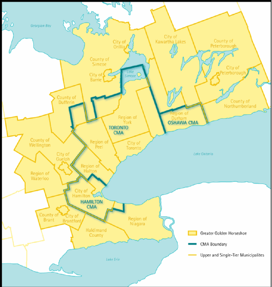

In this notebook, we calculate the car time from origins (centroids of work zones) to destinations (centroids of full-time employment zones) for a one-way morning commute for the golden greater horse area (yellow) as specified by the Transportation Tomorrow Survey (TTS) 2016 dataset. This calculation is performed using [`r5r`](https://github.com/ipeaGIT/r5r) package.


We then we save all objects (the travel time OD matrix, the geometries, IDs, and number of workers and jobs within each traffic analysis zones (TAZ), and trips from work to job) as an intermediate object for further data processing in the next notebook '02-TTS-16-Imp-Function-Trip-Length-Distribution.Rmd'. 

Libraries:
```{r setup, include=FALSE}
library(disk.frame)
library(dplyr)
library(ggplot2)
library(gridExtra)
library(httr)
library(knitr)
#install.packages("kableExtra", dependencies = TRUE) #installing kableExtra and dependencies as I was receiving errors
library(kableExtra)
# install.packages("devtools")
# install.packages("Rtools")
# devtools::install_github("https://github.com/hrbrmstr/lodes.git", dependencies = TRUE) # if you need to download
library(lodes)
library(progress)
library(purrr)
library(r5r)
library(sf)
library(stplanr)
library(tidycensus)
library(tidyr)
library(tmap)
library(zoo) # for rollapplyr

# setup options
setup_disk.frame() # setup disk.frame parallel computing
options(future.globals.maxSize = Inf) # allow disk.frame threads to talk to eachother without limits
options(java.parameters = "-Xmx6G") # assign memory for r5r to work with
tmap_mode("plot")
```

##--- Prepare Input Data
loading the destination points and origins points:
```{r}
load(file = "TTS16-data-inputs/Travel-Time-Calculations/inputs/work_origins.Rdata")
load(file = "TTS16-data-inputs/Travel-Time-Calculations/inputs/job_destinations.Rdata")
```


##--- Download OSM Network Data

```{r set up r5 path, include=FALSE}
# the r5r package requires Java Development Kit version 11, which can be downloaded from https://www.oracle.com/java/technologies/javase-jdk11-downloads.html
dir.create("TTS16-data-inputs/Travel-Time-Calculations/r5_graph")
r5_path <- file.path("TTS16-data-inputs/Travel-Time-Calculations/r5_graph")

# create data directories
dir.create("TTS16-data-inputs/Travel-Time-Calculations/data") # for storing data
dir.create("TTS16-data-inputs/Travel-Time-Calculations/df") # for storing od matrix as a disk.frame
dir.create("TTS16-data-inputs/Travel-Time-Calculations/r5_graph") # for the r5 network graph
r5_path <- file.path("TTS16-data-inputs/Travel-Time-Calculations/r5_graph")
```

```{r download data, include=FALSE, eval=FALSE}
#downloading ontario osm in the correct format
download.file(url = paste0("https://download.geofabrik.de/north-america/canada/ontario-latest.osm.pbf"),
              destfile = file.path(r5_path, "osm.pbf"),
              mode = "wb")

```

##--- Set Up R5 Routing

```{r build graph, include = FALSE}
r5_ONT <- setup_r5(data_path = r5_path, verbose = FALSE)
```

##--- Calculate OD Matrices

Car travel time - from all jobs to all work locations
```{r}
# set up batching according to how many origin rows to process at one time
chunksize = 50 
num_chunks = ceiling(nrow(work_origins)/chunksize)

# create origin-destination pairs
origins_chunks <- as.disk.frame(work_origins,
                          outdir = "TTS16-data-inputs/Travel-Time-Calculations/df/Orig",
                          nchunks = num_chunks,
                          overwrite = TRUE)

start.time <- Sys.time()
pb <- txtProgressBar(0, num_chunks, style = 3)

for (i in 1:num_chunks){
  Orig_chunk <- get_chunk(origins_chunks, i)
  ttm_chunk <- travel_time_matrix(r5r_core = r5_ONT,
                          origins = Orig_chunk,
                          destinations = job_destinations,
                          mode = c("CAR"), 
                          departure_datetime = as.POSIXct(strptime("2021-10-20 07:00:00", "%Y-%m-%d %H:%M:%S", tz = "EST5EDT")),
                          max_trip_duration = 180)
  
  # export output as disk.frame
  ifelse(i == 1, output_df <- as.disk.frame(ttm_chunk,
                                            nchunks = 1,
                                            outdir = "TTS16-data-inputs/Travel-Time-Calculations/df/output_ttm",
                                            compress = 50,
                                            overwrite = TRUE),
         add_chunk(output_df, ttm_chunk, chunk_id = i))
  setTxtProgressBar(pb, i)
}
end.time <- Sys.time()
print(paste0("OD matrix calculation took ", round(difftime(end.time, start.time, units = "mins"), digits = 2), " minutes..."))

output_OD_car1 <- as.data.frame(output_df)

save("output_OD_car1", file = "TTS16-data-inputs/Travel-Time-Calculations/results/output_OD_car1.Rdata")
#I made the cut off 180 minutes, so I anticipate a small proportion of trips will not have a travel time calculated. As a note, this code took me 260 mins to execute.
```

Java garbage collector:
```{r}
stop_r5(r5_ONT)
rJava::.jgc(R.gc = TRUE)
```

##--- Joining OD Travel time matrix with taken OD trips

Load:
```{r}
# load(file = "TTS16-data-inputs/Travel-Time-Calculations/results/output_OD_car1.Rdata")
#Trips taken from origin to destination and associated people
load(file = "TTS16-data-inputs/OD-by-FT-Employment/od_ft_p_t.Rdata")
```

```{r}
od_ft_p_t_tt <- od_ft_p_t %>% 
  merge(output_OD_car1, by.x=c("Origin", "Destination"), by.y=c("fromId", "toId"), all.x=T)

rm(output_OD_car1)
summary(od_ft_p_t_tt)
```

Travel time is between 0-179 min with 3507 OD pairs (3.5%) having NA travel time (presumably a travel time greater than 180). This is not a significant number of OD pairs but.. how many trips? Let's check:
```{r}
junk1 <- od_ft_tt %>% filter(is.na(travel_time)) %>% summarize(trips = sum(trips))
junk2 <- od_ft_tt %>% summarize(trips = sum(trips))

junk1/junk2
```

10.9% of trips are NA travel time, that is pretty large. This seems a bit large but we will check the travel time length distribution  

##--- Saving inputs for processing in the next notebook 

See '02-TTS-16-Imp-Function-Trip-Length-Distribution.Rmd' for further analysis:
```{r}
od <- od_ft_p_t_tt
rm(od_ft_p_t_tt)
save("od", file = "TTS16-data-inputs/OD-by-FT-Employment/od.Rdata")
```

