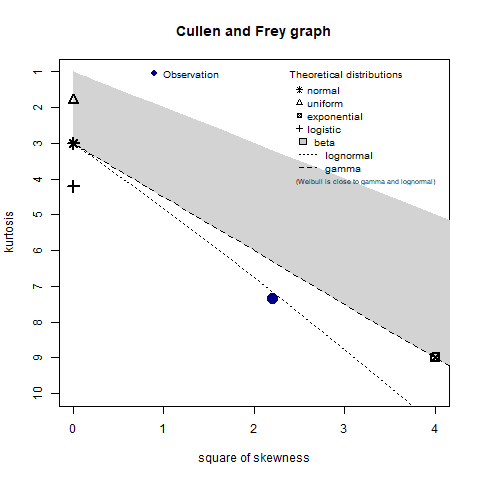

```{r, include = FALSE}
knitr::opts_chunk$set(
  collapse = TRUE,
  comment = "#>"
)
```

```{r install-data-package, include=FALSE}
if (!require("TTS2016R", character.only = TRUE)) {
      remotes::install_github("soukhova/TTS2016R",
                        build_vignettes = TRUE)
  }
```

```{r load-packages, include=FALSE, cache=FALSE}
library(TTS2016R)
library(dplyr)
library(fitdistrplus)
library(ggplot2)
library(kableExtra)
library(patchwork)
library(sf)
library(scales)
library(stats)
library(ggspatial)
library(shadowtext)
library(tmap)
library(here)
# library(ggpmisc)
# library(ggrepel)
# library(cowplot)
# library(spdep)
# library(RColorBrewer)
# library(extrafont)
# font_import()
# loadfonts(device = "win")

options(scipen = 999)
```

**NOTE**: this article was a draft of the now published data paper: @soukhovTTS2016RDataSet2023. It discusses how {TTS2016R} can be used and expands on concepts not included in @soukhovTTS2016RDataSet2023, such as the impedance function and accessibility calculation. These concepts were not covered in the data paper due to brevity requirements.  

# Home-to-work commute data
```{r, echo=FALSE, message=FALSE, warning=FALSE}
# grouping the planning boundaries/municipalities so they make up the 20 regions in the TTS 2016. Note: st_buffer is used as there are small existing gaps between some boundaries. st_buffer of 10 m is enough to widen all boundaries and complete the st_union without issue.
group_ggh_pd_poly <- TTS2016R::ggh_pd %>% st_buffer(10) %>% group_by(REGION) %>% 
  summarize(REGION_name = first(REGION_name),
            geometry = st_union((geometry)))

# creating an object of centroids for each region - this will be used to label polygons on the map
group_ggh_pd <- sf::st_centroid(group_ggh_pd_poly) 
points <- sf::st_coordinates(group_ggh_pd) %>% data.frame() 
group_ggh_pd <- cbind(group_ggh_pd, points)

## manually readjusting the X and Y coordinate of "County of Peterborough" and "Brant" as they overlap some cities
group_ggh_pd[group_ggh_pd$REGION_name=="Brant", "X"] <- 544000.0
group_ggh_pd[group_ggh_pd$REGION_name=="Brant", "Y"] <- 4767466

group_ggh_pd[group_ggh_pd$REGION_name=="Peterborough County", "Y"] <- 4921000
```

```{r, out.height="120%", fig.align='center'}
#plot 
ggplot() +
  geom_sf(data = TTS2016R::ggh_pd,
          fill = "gainsboro", color = "darkgray") +
  geom_sf(data = group_ggh_pd_poly, 
          color = "steelblue", fill = NA, size = 0.7) +
  annotation_north_arrow(location = "tl", # north arrow for both the main plot and inset
                         height = unit(0.8, "cm"), 
                         width = unit(0.8, "cm"),
                         style = north_arrow_orienteering(line_width = 0.25,
                                                          line_col = "dimgrey", 
                                                          fill = c("white","dimgrey"))) +
  annotation_scale(bar_cols = c("dimgrey", "white"), # scale bar for both the main plot and inset
                   height = unit(0.15, "cm")) + 
  geom_shadowtext(data = group_ggh_pd,
                  aes(x = X, y = Y, label = REGION_name),
                  size = 2.5,
                  nudge_y = 3000,
                  nudge_x = 2000) +
  theme_minimal() +
  theme(legend.position = "none",
        axis.title = element_blank()) 
```
__Figure 1.__ _The TTS 2016 study area within the Greater Golden Horseshoe in Ontario, Canada._

```{r creating-desc-stats-table, echo=FALSE, message=FALSE, warning=FALSE}
#forming a complete descriptive statistic table

Statistics <- data.frame("Statistics" = c("Min.", "1st Qu.", "Median", "Mean", "3rd Qu.", "Max.", "NA's"))

Trips <- data.frame("OD_Trips" = c(summary(od$Persons)[[1]] %>% round(), 
                                   summary(od$Persons)[[2]] %>% round(),  
                                   summary(od$Persons)[[3]] %>% round(), 
                                   summary(od$Persons)[[4]] %>% round(), 
                                   summary(od$Persons)[[5]] %>% round(),
                                   summary(od$Persons)[[6]]%>% round(),
                                   NA))

Travel_time <- data.frame("OD_Travel_time" = c(summary(od$travel_time)[[1]] %>% round(), 
                                               summary(od$travel_time)[[2]] %>% round(),  
                                               summary(od$travel_time)[[3]] %>% round(), 
                                               summary(od$travel_time)[[4]] %>% round(), 
                                               summary(od$travel_time)[[5]] %>% round(), 
                                               summary(od$travel_time)[[6]] %>% round(),  
                                               3507)) 

TAZ_Area <- data.frame("TAZ_Area" = c(summary(ggh_taz$AREA)[[1]] %>% round(), 
                                      summary(ggh_taz$AREA)[[2]] %>% round(), 
                                      summary(ggh_taz$AREA)[[3]] %>% round(), 
                                      summary(ggh_taz$AREA)[[4]] %>% round(), 
                                      summary(ggh_taz$AREA)[[5]] %>% round(), 
                                      summary(ggh_taz$AREA)[[6]] %>% round(), 
                                      NA))

Workers <- data.frame("Workers" = c(summary(ggh_taz$workers)[[1]] %>% round(), 
                                    summary(ggh_taz$workers)[[2]] %>% round(), 
                                    summary(ggh_taz$workers)[[3]] %>% round(), 
                                    summary(ggh_taz$workers)[[4]] %>% round(), 
                                    summary(ggh_taz$workers)[[5]] %>% round(), 
                                    summary(ggh_taz$workers)[[6]] %>% round(), 
                                    NA))

Jobs <- data.frame("Jobs" = c(summary(ggh_taz$jobs)[[1]] %>% round(), 
                              summary(ggh_taz$jobs)[[2]] %>% round(), 
                              summary(ggh_taz$jobs)[[3]] %>% round(), 
                              summary(ggh_taz$jobs)[[4]] %>% round(), 
                              summary(ggh_taz$jobs)[[5]] %>% round(), 
                              summary(ggh_taz$jobs)[[6]] %>% round(), 
                              NA)) 

desc_stats <- cbind(Statistics, Trips, Travel_time, TAZ_Area, Workers, Jobs)

#kable tabling 
desc_stats %>%
  kable(format = "html",
        align="lrrrrrr",
        booktabs = T,
        col.names = c(" ", "No.", "(min)", "(km^2)", "No.", "No.")) %>%
  add_header_above(c(" ", "Trips", "Car Travel Time", "Area", "Workers", "Jobs"), align = "r")%>%
  kable_styling(position = "center")
```

__Table 1.__ _Descriptive statistics of the Persons, workers, and jobs for the traffic analysis zones (TAZ) from the TTS 2016 data set along with estimated car origin-destination travel times._

In terms of commute data, this data package includes data related to the full-time employed population by place of residence (origin), full-time usual place of work (destination), and the number of trips to work by mode and the calculated potential travel time of the trips in the Greater Golden Horseshoe (GGH) area.

This data is aggregated and available at the level of TAZ: TAZ are a spatial unit of analysis typically used to estimate the number of trips produced and attracted to each zone. They are thus defined by transportation planners for a region based on intra-similarity and inter-dissimilarity between land-use and population demographics. 

Within the TTS, there are `r round(length(TTS2016R::ggh_taz$GTA06), 3) %>% prettyNum(big.mark = ",")` TAZ. For each TAZ there is a unique identifier that corresponds to the GTA06 Zoning System. The survey boundaries are discussed in the 2016 TTS methodology and defined by the TTS [@data_management_group_tts_2018]. The TAZ range between $\ge$ 0.019 km^2^ in spatial area to a maximum of `r max(TTS2016R::ggh_taz$AREA) %>% prettyNum(digits =2, big.mark = ",")` km^2^ (median: `r median(TTS2016R::ggh_taz$AREA) %>% prettyNum(digits =2, big.mark = ",")` km^2^ and 3rd quantile: `r quantile(TTS2016R::ggh_taz$AREA, probs=0.75) %>% unname() %>% prettyNum(digits =2, big.mark = ",")` km^2^).

The number of jobs (`r round(sum(TTS2016R::ggh_taz$jobs), 3) %>% prettyNum(big.mark = ",")`) and workers (`r round(sum(TTS2016R::ggh_taz$workers), 3) %>% prettyNum(big.mark = ",")`) are organized in the form of an origin-destination (OD) table. These data were retrieved from the Transportation Tomorrow Survey Data Retrieval System on October 28, 2021 and reflect the potential interaction of full-time employed people and jobs within the GGH survey boundaries shown in Figure 1.

Also included in {TTS2016R} are travel times and cost of travel from origin to destination by car; travel times are calculated using the {r5r} package [@Pereira2021r5r]. These travel times are useful to estimate the cost of travel and to calculate impedance functions, among other possible uses. It is important to note that for simplicity, all interactions within {TTS2016R} are assumed to be taken by car, and the travel time is calculated from an origin TAZ centroid to a destination TAZ centroid. The centroid is snapped to the nearest street line by {r5r} and the travel time is calculated for all trips assuming a car travel mode. Additionally, only travel times less than or equal to 180 mins (3 hrs) are calculated; this threshold represents 99% of trip's travel times which are summarized in the descriptive statistics in Table 1.

## Full-time employed people and associated places of employment

The origin-destination information consists of a cross-tabulation of people who are employed full-time by place of residence (origin) and places of employment in the GGH (destination) using the GTA06 zoning system. The number of workers and jobs is not equal; the boundaries of the survey are permeable, so workers who reside within the boundaries but travel outside of the boundaries are counted as workers within an origin TAZ, while jobs in TAZ that are filled by workers who reside outside the GGH boundaries are _unknown_ since they were not surveyed. This mismatch results in the total number of workers being `r round(sum(ggh_taz$workers)/sum(ggh_taz$jobs),2)` times larger than the total number of jobs (i.e., `r sum(ggh_taz$workers)%>% prettyNum(big.mark = ",")` workers to `r sum(ggh_taz$jobs)%>% prettyNum(big.mark = ",")` jobs).
The TTS is a proportionally representative survey; hence, the values included in {TTS2016R} are adjusted to reflect the GGH working population and their home-based trips to places of GGH employment. 

```{r tts-workers-jobs-plot, fig.width=8, fig.height=11}
tts_workers <- tm_shape(ggh_taz) +
  tm_fill(col = "workers", title = "Full-time employed people", palette = "-Spectral", style = "jenks") +
  tm_compass(type = "arrow", position = c("left", "top"), size = 2) +
  tm_scale_bar(breaks = c(0, 30, 60), text.size = 0.5, position = c("left", "bottom")) +
  tm_layout(legend.position = c("right", "bottom"))

tts_jobs <- tm_shape(ggh_taz) +
  tm_fill(col = "jobs", title = "Full-time jobs", palette = "-Spectral", style = "jenks") +
  tm_compass(type = "arrow", position = c("left", "top"), size = 2) +
  tm_scale_bar(breaks = c(0, 30, 60), text.size = 0.5, position = c("left", "bottom")) +
  tm_layout(legend.position = c("right", "bottom"))

tmap_arrange(tts_workers, tts_jobs)
```

__Figure 2.__ _Number of workers (top) and jobs (bottom) in each TAZ in the GGH area as specified in the 2016 TTS._

```{r ECD-plot}
Number <- rbind(ggh_taz$jobs %>% data.frame(),
                 ggh_taz$workers %>% data.frame())
Group <- rbind(rep("Jobs", each=length(ggh_taz$jobs)) %>% data.frame(),
                rep("Workers", each=length(ggh_taz$workers))%>% data.frame())

ecdf_data <- cbind(Number, Group)
colnames(ecdf_data) <- c("Number", "Group")

rect1 <- data.frame(xmin=115, xmax=3055, ymin=-Inf, ymax=Inf)
  
ggplot(ecdf_data , aes(x=Number, col=Group)) + 
  # geom_segment(aes(x = 115, y = 0, xend = 115, yend = 0.34), col = "blue", linetype=2) +
  # geom_segment(aes(x = 3055, y = 0, xend = 3055, yend = 0.94), col = "blue", linetype=2) +
  geom_rect(data = rect1, aes(xmin=xmin, xmax=xmax, ymin=ymin, ymax=ymax), fill="lightblue", alpha=0.2, inherit.aes = FALSE) +
  stat_ecdf() + 
  scale_x_continuous(trans='sqrt', breaks=c(115, 3055, 10000, 20000, 30000, 40000)) + 
  scale_y_continuous(breaks=c(0, 0.25,0.34, .50, .75,0.94, 1.00)) +
  labs(x = "Opportunities per TAZ",
       y = "Cumulative probability") + 
      scale_color_manual("Opportunities", 
                         values = c("Jobs" = "Black",
                                    "Workers" = "Red"))+
  scale_linetype_manual("Opportunities",values=c(0,1)) +
  geom_point(aes(x = 115, y = 0.34), col = "blue")+
  geom_point(aes(x=3055, y=0.94), col = "blue") +
  theme_minimal() +
  theme(plot.title = element_text(hjust=0.5),
        legend.position = c(0.90,0.75),
        axis.line = element_line(colour = "black"),
        panel.border = element_blank()) 
```

__Figure 3.__ _The cumulative distribution of the number of jobs and workers per TAZ from the 2016 TTS data set. Light blue shaded ranges correspond to all cumulative probabilities where the number of workers per TAZ are larger than jobs per TAZ._

Figure 2 presents the number of workers and jobs per TAZ. It can be observed that the spatial distribution of jobs and workers is unequal. This could indicate a jobs-housing imbalance which can impact accessibility in a region [@Levine1998rethinking]. Workers are concentrated in TAZ within the center of the GGH and along the south-east and northern boarder of the GGH. The center of the GGH corresponds to the Greater Toronto Area (GTA), the most densely populated area in southern Ontario [@statistics_canada_daily_2022]. The south east border of the GGH neighbours Lake Ontario and is delineated by the urban built boundary of the Ontario Growth Plan being home to the highest density of working population in the GGH [@ontario_built_2019;@auditor_general_of_ontario_value_2021]. The northern GGH border corresponds to the Simcoe, Dufferin, Kawartha Lake, and Peterborough regions which are home to lower density of worker population density population [@auditor_general_of_ontario_value_2021]. Conversely, the spread of jobs in the GGH is lower than the number of workers indicating population may be more spatially dispersed than jobs. 

It can also be seen that from the bottom plot in Figure 2 that high to medium-low concentrations of jobs are often present in the same areas as workers but only when the scale is transformed. In other words, though there is a higher number of TAZ with no workers than zones with no jobs (i.e., `r ggh_taz %>% st_drop_geometry() %>% count(workers) %>% filter(workers == 0) %>% pull('n')` TAZ with no workers : `r ggh_taz %>% st_drop_geometry() %>% count(jobs) %>% filter(jobs == 0) %>% pull('n')` TAZ with no jobs) and the mean of workers per TAZ is higher than the mean of jobs (i.e., `r round(mean(ggh_taz$workers, na.rm=T),0)` workers : `r round(mean(ggh_taz$jobs, na.rm=T),0)` jobs) the number TAZ with an extreme number of jobs at the highest and lowest percentiles is higher than the number of workers; see the following cumulative probability distribution in Figure 3, the 94th to 100th percentile and the 0th to 34th percentile of jobs in TAZ is higher than the number of workers in TAZ. This means that between these ranges, TAZ have a higher number of workers than they do jobs, echoing the more unique spatial distribution trend of workers observed in Figure 2.

## Calculated travel time
{TTS2016R} also includes travel time data for each home-to-work trip as displayed in Figure 4. This travel time corresponds to a car commute calculated using the R package {r5r} and could be interpreted as the _network distance_ travel time for a full-time work commute in the GGH. The travel times were calculated assuming the following input parameters: a maximum travel time less than or equal to 180 mins (3 hrs) and a street network retrieved from OpenStreetMaps for the GGH area. The 3 hr threshold was selected as it captures 99% of the trip taken (see the travel times summarized in Table 1. 

It is important to note that the travel times within this data set reflect car travel, centroids of origins to destinations, and an uncongested street network. These assumptions are not completely realistic, but are done for generalization and due to data limitations. The car mode for commuting is still critically important, as `r (sum(od$C_DPC, od$C_PPC, od$C_RS, od$C_SB, od$C_TA) / sum(od$sum_trips)) %>% percent()` of the work trips are made this way. Additionally, a finer resolutions of data nor average departure times are publicly available through the TTS Data Retrieval System. As such, we include the number of mode-specific trips from each OD pair so the user can make their own mode- and associated travel time/cost specific assumptions.

```{r data-for-impedance, eval=FALSE}
# remove all NA trips from dataset and set all 0min travel times to 0.1 min
od  <- TTS2016R::od %>%
  filter( !is.na(travel_time)) %>%
  mutate(travel_time = ifelse(travel_time == 0, 0.1, travel_time))

all_tt <- od  %>%
  dplyr::select(Persons, travel_time)

all_tt <- all_tt[rep(seq_len(dim(all_tt)[1]), all_tt$Persons), 2]

#fitting impedance function
gamma_ <- fitdistrplus::fitdist(data=all_tt, "gamma", method="mle", optim.method="Nelder-Mead")
```
```{r data-for-impedance-load, include=FALSE}
# save(gamma_, file=paste0(here::here(),"/data-raw/TTS16-data-inputs/gamma_.Rdata"))
load(file="gamma_.Rdata")
```

```{r calc-for-accessibility-GGH}
# transfer calibrated impedance function values to OD matrix
od <- od %>%
  mutate(f = dgamma(travel_time, gamma_$estimate["shape"], gamma_$estimate["rate"]))

#add the number of jobs and workers to the od matrix
od_ft <- od %>% merge(ggh_taz %>% dplyr::select(GTA06, workers) %>% st_drop_geometry(),
                   by.x = "Origin", by.y="GTA06", all.x = TRUE)

od_ft <- od_ft %>% merge(ggh_taz %>% dplyr::select(GTA06, jobs) %>% st_drop_geometry(),
                   by.x = "Destination", by.y="GTA06", all.x = TRUE)

#calculate accessibility for workers from any origin to jobs in Toronto 
GGH_c_accessibility <- od_ft %>% 
  mutate(GGH_A_ij = f * jobs) %>%
  group_by(Origin) %>%
  summarise(GGH_A_i = sum(GGH_A_ij, na.rm = T),
            GGH_sum_tt_i = sum(travel_time),
            GGH_tt_trips_i = mean(travel_time),
            GGH_sum_f_i = sum(f),
            GGH_f_trips_i = mean(f))

#Merge TO accessibly calculation to the ggh_taz:
GGH_taz_acc <- ggh_taz %>% merge(GGH_c_accessibility, by.x=c("GTA06"), by.y=c("Origin"), all.x=T) 
```

```{r plot-tt-ttpertrip,  fig.width=8, fig.height=11, message=FALSE}
tts_total_tt <- tm_shape(GGH_taz_acc) +
  tm_fill(col = "GGH_sum_tt_i", title = "Total travel time\n per TAZ (min)", palette = "-Spectral", style = "jenks") +
  tm_compass(type = "arrow", position = c("left", "top"), size = 2) +
  tm_scale_bar(breaks = c(0, 30, 60), text.size = 0.5, position = c("left", "bottom")) +
  tm_layout(legend.position = c("right", "bottom"))

tts_tt_per_trip <- tm_shape(GGH_taz_acc) +
  tm_fill(col = "GGH_tt_trips_i", title = "Avg. travel time\n per TAZ (min)", palette = "-Spectral", style = "jenks") +
  tm_compass(type = "arrow", position = c("left", "top"), size = 2) +
  tm_scale_bar(breaks = c(0, 30, 60), text.size = 0.5, position = c("left", "bottom")) +
  tm_layout(legend.position = c("right", "bottom"))

tmap_arrange(tts_total_tt, tts_tt_per_trip)
```

__Figure 4.__ _Estimated total worker travel time (top) and average worker travel time (bottom) for each TAZ in the GGH. Travel times reflect uncongested car travel from origin centroid to destination centroid._

As can be observed in Figure 4, the total travel time (min) resembles the spatial trend distribution in the number of employed people in the previous plot (Figure 2). However, when the average travel time per trip in each TAZ is presented, the spatial distribution is distinct from all other plots presented so far. We can see that in areas around the south-eastern border that make up the Greater Toronto and Hamilton Area (GTHA) (e.g., Hamilton, Halton, Peel, Toronto, York, Durham) and Niagara and Waterloo, the average travel times are moderately low. Further from these areas, travel times are higher. Interestingly, even in eastern areas (e.g., Peterborough) with high employment and high job concentration, average travel time is higher than within the GTHA.

## Calibrating an impedance function

Impedance functions are useful to understand mobility behavior and are part, for instance, of gravity models of spatial interaction [@wilson1971; @haynes_gravity_1985] and accessibility analysis in many applications [@hansen_how_1959;@levinson_accessibility_1998;@talen_assessing_1998;@reggiani_accessibility_2011;@paez_jobs_2013;@kuai_examining_2017; @barboza_balancing_2021]. An OD matrix and a cost matrix (i.e., with travel times) can be used in combination to estimate impedance functions. An impedance function $f(\cdot)$ depends on the cost of travel between locations $i$ and $j$ $c_{ij}$; it usually is a monotonically decreasing function, although sometimes the function can increase to reflect patterns of separation between activities; for instance, separation of land uses means that very short commuting trips are relatively rare. There can also be fluctuations due to hierarchical patterns, where travelers bypass opportunities in favor of more distant destinations that offer economies of agglomeration.

A useful technique to calibrate an impedance function is to use the trip length distribution (TLD) as measured from origin-destination data [@horbachov_theoretical_2018; @batista_estimation_2019]. The TLD is the representation of the likelihood that a proportion of trips are taken at a specific travel cost. In our data set, where we assume cost is travel time, the impedance function maps low travel times to higher proportions of trips, and high travel times are mapped to low proportion of trips.

```{r TLD-Gamma-plot, eval=FALSE, fig.height = 6, fig.width=8}
plot(gamma_)
```

```{r TLD-Gamma-plot-load, echo=FALSE}
# png(file=paste0(here::here(),"/data-raw/TTS16-data-inputs/gamma_plot.png"))
# plot(gamma_)
# dev.off() 
knitr::include_graphics("gamma_plot.png")
```

__Figure 5.__ _Empirical TTS 2016 home-based car trip length distribution (black) and calibrated gamma distribution impedance function (red) with associated Q-Q and P-P plots._

```{r create-cullen-frey-data, message = FALSE, echo=FALSE, eval=FALSE, fig.height=6, fig.width=8}
# remove all NA Persons from dataset and set all 0min travel times to 0.1min
od  <- od %>% filter( !is.na(travel_time)) %>% mutate(travel_time = ifelse(travel_time == 0, 0.1, travel_time))
all_tt <- od  %>% dplyr::select(Persons, travel_time)
all_tt <- all_tt[rep(seq_len(dim(all_tt)[1]), all_tt$Persons), 2]

fitdistrplus::descdist(data=all_tt) 
```

```{r create-cullen-frey-data-load, echo=FALSE}
# od  <- od %>% filter( !is.na(travel_time)) %>% mutate(travel_time = ifelse(travel_time == 0, 0.1, travel_time))
# all_tt <- od  %>% dplyr::select(Persons, travel_time)
# all_tt <- all_tt[rep(seq_len(dim(all_tt)[1]), all_tt$Persons), 2]
# png(file=paste0(here::here(),"/data-raw/TTS16-data-inputs/cullen-frey_plot.png"))
# fitdistrplus::descdist(data=all_tt) 
# dev.off() 

```

__Figure 6.__ _Cullen and frey graph for the 2016 TTS calculated travel times._

In the GGH data presented, the empirical TLD (i.e., proportion of trips taken vs. travel time in minutes) is fitted to a density distribution using maximum likelihood techniques and the Nelder-Mead method for direct optimization available within the `fitdistrplus` package [@fitdistrplus_2015]. Based on goodness-of-fit criteria and diagnostics seen in Figure 5 and Figure 6, the gamma distribution is selected for the presented data. 

The resulting calibrated impedance function is given in the following general form where the estimated 'shape' is $\alpha$ = `r round(gamma_$estimate[1], 3)`, the estimated 'rate' is $\beta$ = `r round(gamma_$estimate[2], 3)` , and $\Gamma(\alpha)$ is defined in Equation (1).

\begin{equation}
\begin{array}{l}\ 
f(x, \alpha, \beta) = \frac {x^{\alpha-1}e^{-\frac{x}{\beta}}}{ \beta^{\alpha}\Gamma(\alpha)} \quad \text{for }	0 \leq x \leq \infty\\
\Gamma(\alpha) =  \int_{0}^{\infty} x^{\alpha-1}e^{-x} \,dx\\
\end{array}
\end{equation}

# Accessibility to employment

As noted above, impedance functions are an essential component of accessibility analysis. Equation (2) shows that accessibility $A_i$ is the weighted sum of opportunities that can be reached from location $i$, given the cost of travel $c_{ij}$. Summing the opportunities in the neighborhood of $i$ as defined by the impedance function $f(\cdot)$, provides estimates of the number of opportunities that can be reached from $i$ at a certain cost. 

\begin{equation}
A_i = \sum_{j=1}^JO_jf(c_{ij})
\end{equation}

\noindent where:

-   $A$ is accessibility. 
-   $i$ is a set of origin locations.
-   $j$ is a set of destination locations.
-   $O_j$ is the number of opportunities at location $j$. These are opportunities for activity and add some sort of *supply* to the area;
-   $c_{ij}$ is a measure of the cost of moving between $i$ and $j$
-   $f(\cdot)$ is an impedance function of $c_{ij}$.

```{r access-per-worker}
GGH_taz_acc <- GGH_taz_acc %>%
  mutate(avg_A_per_W = GGH_A_i/workers)
```

```{r plot-access-SA-GGH-TTS, fig.width=8, fig.height=11, message=FALSE}
## accessibility
access_TTS_GGH <- tm_shape(GGH_taz_acc) +
  tm_fill(col = "GGH_A_i", title = "Accessibility \n(A_i)", palette = "-Spectral", style = "jenks") +
  tm_compass(type = "arrow", position = c("left", "top"), size = 2) +
  tm_scale_bar(breaks = c(0, 30, 60), text.size = 0.5, position = c("left", "bottom")) +
  tm_layout(legend.position = c("right", "bottom"))

access_normalized_TTS_GGH <- tm_shape(GGH_taz_acc) +
  tm_fill(col = "avg_A_per_W", title = "Average accessibility \nper worker", palette = "-Spectral", style = "jenks") +
  tm_compass(type = "arrow", position = c("left", "top"), size = 2) +
  tm_scale_bar(breaks = c(0, 30, 60), text.size = 0.5, position = c("left", "bottom")) +
  tm_layout(legend.position = c("right", "bottom"))

tmap_arrange(access_TTS_GGH, access_normalized_TTS_GGH)
```

__Figure 7.__ _Accessibility (top) and normalized accessibility (bottom) to employment in the GGH area._

Accessibility is a property of the origin (i.e., origin TAZ in our data), the landscape of opportunities (i.e., the TAZ destinations in our data), and transportation infrastructure (i.e., the travel time table). Figure 7 presents the accessibility estimates that result from the impedance function calibrated in the preceding section. The top plot, that of the raw accessibility values, presents a distinct radial trend where the majority of TAZ in and around Toronto have high accessibility values and values gradually decrease in TAZ which are further from Toronto's boundary. Alternatively, the bottom plot in Figure 7 presents the worker-normalized accessibility values. In other words, the accessibility value for each TAZ is divided by the number of workers in each TAZ. The patterns in this plot are similar to the Greater Toronto Area radial trend observed in the top plot but are less extreme (i.e., smaller spread). 

# Concluding remarks

The open data product introduced in this paper shares tables for worker-to-employment data from the 2016 TTS aggregated by TAZ. In addition, inter-centroid travel time tables are calculated, and the planning/municipality boundaries are included to compliment the 2016 TTS data. This open data product, {TTS2016R}, is freely available to explore in an `R` environment. One possible use of these data, as showcased in this paper, is the calibration of impedance functions which in turn can be used for accessibility analysis.

New digital formats are increasingly complex and the explanation of the methods often do not concisely and intelligibly fit within the confines of a traditional article. With this motivation, we invite all who are interested to use {TTS2016R} to explore the worker-employment patterns contained in the {TTS2016R} package. In the spirit of novel and original research, we hope readers value the efforts made to detail the data in order to improve transparency in our work and encourage others to replicate and, hopefully, inspire research of their own. We see this product as providing open infrastructure for additional TTS or complimentary data sets to be amended by the authors or wider open-source community in the future. 

# References {#references .unnumbered}
